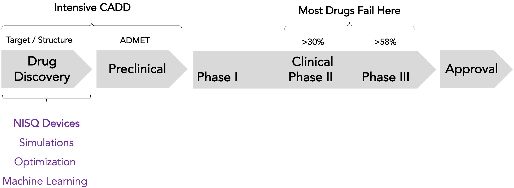

# In Silico Quantum

**In Silico Quantum** is a __Quantum Computation__ based package for various steps in __Drug Design and Discovery__. Drug design is a highly complicated process and It involves lots of steps. By InSilicoQ, we aim to utilize Quantum Computing for faster Virtual Screening, Small Molecule and De Novo drug design. 




## A few words about Quantum Computing

Quantum commuting is emerging as a powerful computational model. The main algorithms implemented in the package consist of Variational Quantum Algorithms (VQA)
and Quantum Machine Learning Algorithms. 

## A few words about Drug Design 
The applications included in the first steps are using the speedup offered by __Quantum Algorithms__ mentioned above for __Property Prediction__,__Molecule Generation__, __Genome Sequencing__ and more. 

## Technologies
The project uses __Qiskit__ for performing Quantum Computation routines which is a __IBM SDK__. The __Colab Notebook__ provides a guide how to use the integrated packages. Integrated Tools and Datasets:

* Qiskit
* Tensorflow
* Rdkit
* Pubchem API
* ChEMBL API

## Installation

```
$git clone https://github.com/QaiAbdi/InSilicoQ.git
$cd ../InSilicoQ
$pip install -r requirments.txt
$python setup.py install
```


## Project Status
 In progress ... 
 - Data Encoding Added
 - Quantum Kernel methods Added
 - Quantum GAN Added
 


