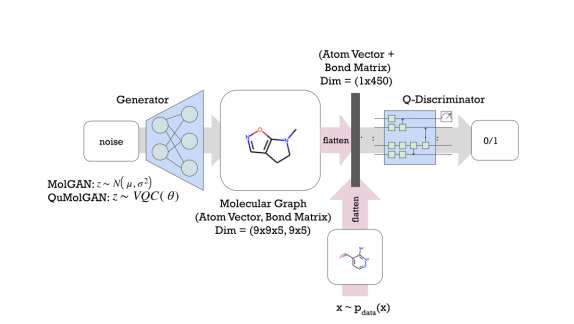
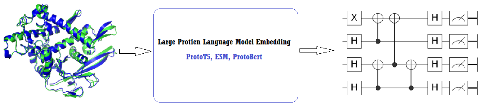

[](https://colab.research.google.com/drive/1x11iRW3juud9GJt3kvZA24tzGrR4xaWc?usp=sharing)


**In Silico Quantum** is a __Quantum Computation__ based package for various steps in __Drug Design and Discovery__. By InSilicoQ, we aim to utilize Quantum Computing and Machine Learning for faster Virtual Screening, Small Molecule and De Novo drug design. 


## How it works

Quantum commuting is emerging as a powerful computational model. The main algorithms implemented in the package consist of Variational Quantum Algorithms (VQA)
and Quantum Machine Learning Algorithms.The applications included in the first steps are using the speedup offered by __Quantum Algorithms__ mentioned above for __Property Prediction__,__Molecule Generation__, __Genome Sequencing__ and more.

__Installation__
``` bash
$pip install git+https://github.com/farhad-abdi/InSilicoQ.git
```

__Peurly quantum computation procedures__, first you need to prepare or encode data using methods like angle encoding, amplitude encoding. Next you need to define the qunatum network using predefined packages in the repo and finnaly doing quantum mesearment.


__Hybrid calssical machine learning and quantum computing__, in this setup part of network or algorithm is classic and other part is quantum. For classical part you can use GAN, CNN, ...


__Large Protien Language Models__, emmbeding of Large language Models(LLM) pretrained on protien sequences can be used for downstream protien tasks.


### Technologies
The project uses __Qiskit__ for performing Quantum Computation routines which is a __IBM SDK__. The __Colab Notebook__ provides a guide how to use the integrated packages. Integrated Tools and Datasets:

* Qiskit
* PyTorch
* Rdkit
* Pubchem API
* ChEMBL API


## Contribution
If you are a researcher in quantum computing, drug design or machine learning feel free to open an issue we can exchange ideas!


## Project Status
 In progress ... 
 - [x] Data Encoding 
 - [x] Quantum Kernel methods 
 - [x] Quantum GAN 
 - [x] Classic Networks 
 - [x] Reading Fasta
 - [x] Transformers


