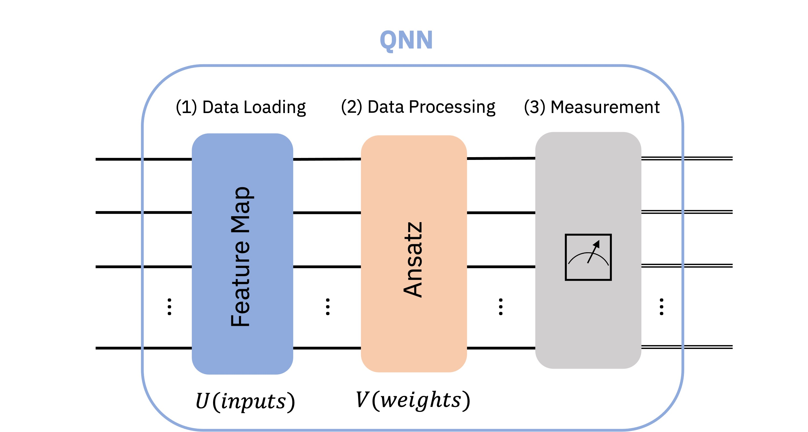

# In Silico Quantum

**In Silico Quantum** is a __Quantum Computation__ based package for various steps in __Drug Design and Discovery__. Drug design is a highly complicated process and It involves lots of steps. By InSilicoQ, we aim to utilize Quantum Computing for faster Virtual Screening, Small Molecule and De Novo drug design. 


## Quantum Computing

Quantum commuting is emerging as a powerful computational model. The main algorithms implemented in the package consist of Variational Quantum Algorithms (VQA)
and Quantum Machine Learning Algorithms. 

## Drug Design 
The applications included in the first steps are using the speedup offered by __Quantum Algorithms__ mentioned above for __Property Prediction__,__Molecule Generation__, __Genome Sequencing__ and more. 


## How it works

Peurly quantum computation procedures, first you need to prepare or encode data using methods like angle encoding, amplitude encoding. Next you need to define the qunatum network using predefined packages in the repo and finnaly doing quantum mesearment.


Hybrid calssical machine learning and quantum computing, in this setup part of network or algorithm is classic and other part is quantum. For classical part you can use GAN, CNN, ... or  emmbeding of Large language Models(LLM) pretrained on protien sequence for protien tasks.


### Technologies
The project uses __Qiskit__ for performing Quantum Computation routines which is a __IBM SDK__. The __Colab Notebook__ provides a guide how to use the integrated packages. Integrated Tools and Datasets:

* Qiskit
* PyTorch
* Rdkit
* Pubchem API
* ChEMBL API

## Installation

```
$git clone https://github.com/QaiAbdi/InSilicoQ.git
$cd ../InSilicoQ
$pip install -r requirments.txt
$python setup.py install
```

## Contribution
Don't hesitate! If you are a researcher in quantum computing, drug design or machine learning feel free to open an issue we can exchange ideas!


## Project Status
 In progress ... 
 - Data Encoding Added
 - Quantum Kernel methods Added
 - Quantum GAN Added
 - Classic Part mostly done


